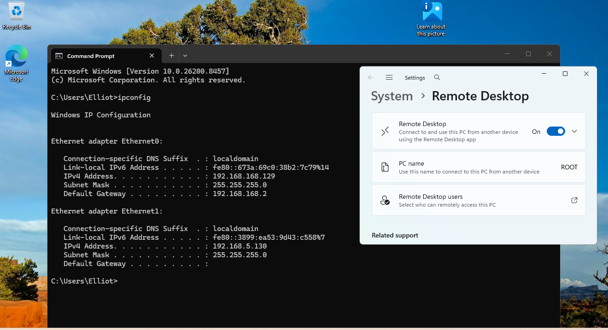
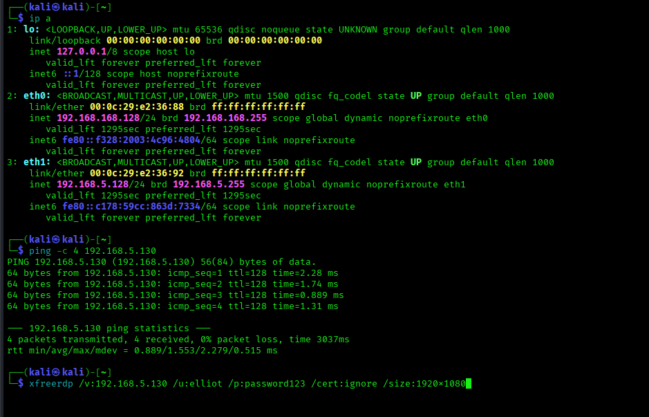
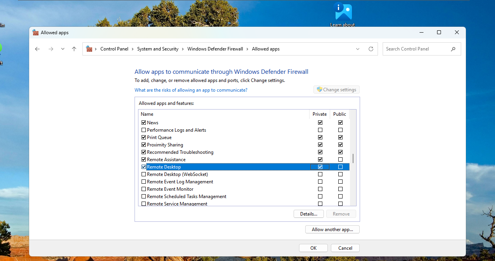
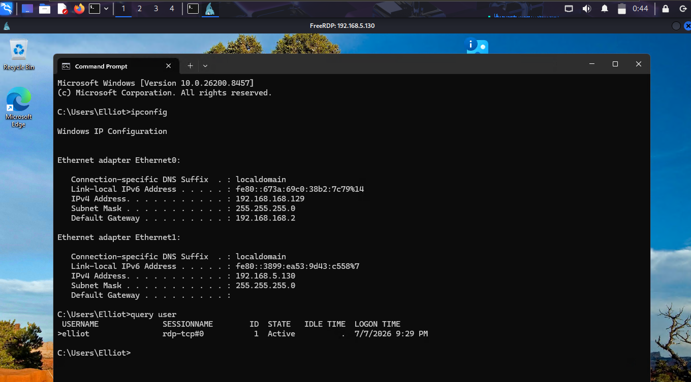

# Windows Remote Desktop (RDP)

## Objective

Remotely connect from a Kali Linux virtual machine to a Windows 11 virtual machine using RDP.

---

## Environment

- VMware Workstation
- Windows 11
- Kali Linux
- xfreerdp

---

## Steps

1. Enabled Remote Desktop on Windows.
2. Found the windows IP address.
3. Connected from kali using xfreerdp.
4. Troubleshooted a firewall issue.
5. Verified successful remote administration.

---

## Issue Encountered

The RDP connection failed.

### Cause

Windows Defender Firewall blocked inbound RDP traffic.

### Solution

Enabled the Windows Firewall rules for Remote Desktop.

---

## Commands Used

```bash
ipconfig
```

```bash
ping -c 4
```

```bash
ip a
```

```bash
xfreerdp /v:<IP> /u:<username> /p:<password> /cert:ignore /size:1920x1080
```

```bash
query user
```

---

## Skills Practiced

- Windows administration
- Remote Desktop Protocol (RDP)
- Windows Firewall
- Troubleshooting
- Remote administration from Linux

## What I Learned

- How to configure Remote Desktop on Windows 11.
- How to remotely administer a Windows machine from Kali Linux using `xfreerdp`.
- How to identify a Windows machine's IP address using `ipconfig`.
- How to verify network connectivity using `ping`.
- How Windows Defender Firewall can block inbound RDP connections and how to resolve the issue.
- The importance of troubleshooting connectivity step by step instead of assuming the client or server is misconfigured.

## Screenshots

The following screenshots show the key stages of configuring and verifying the RDP connection.








