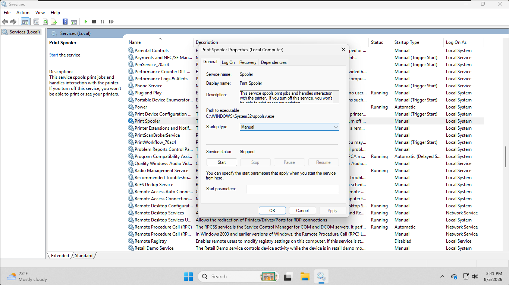
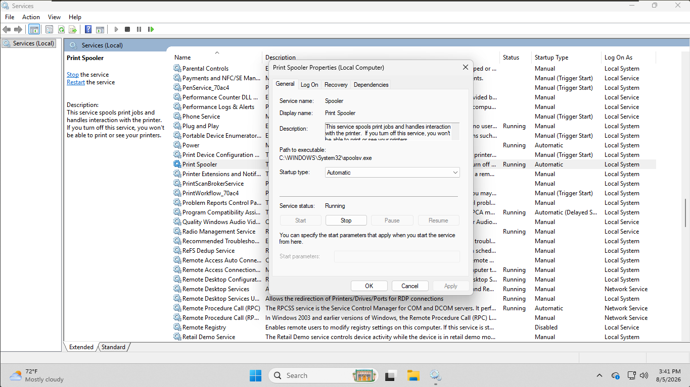
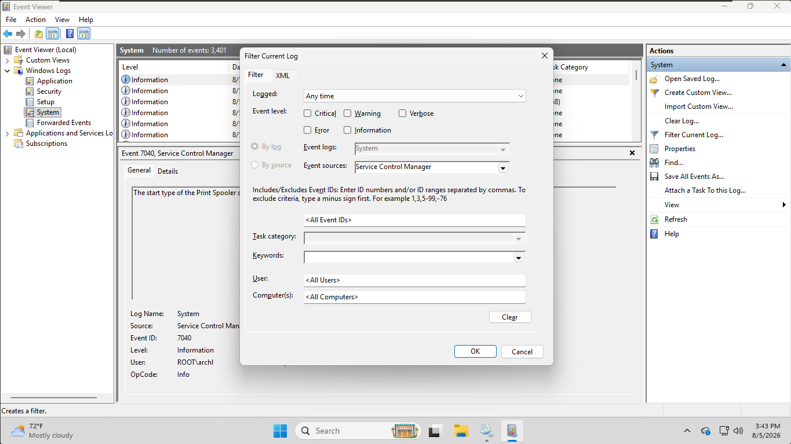
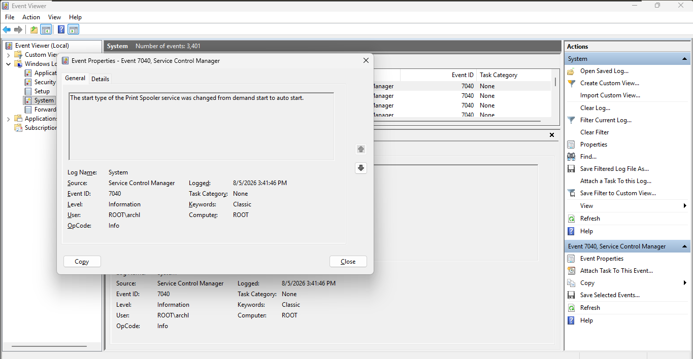
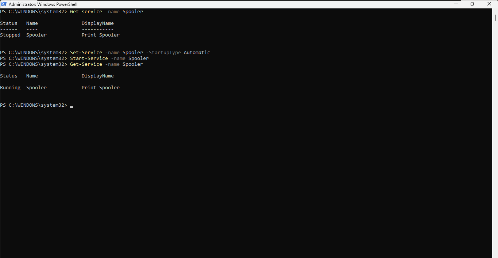
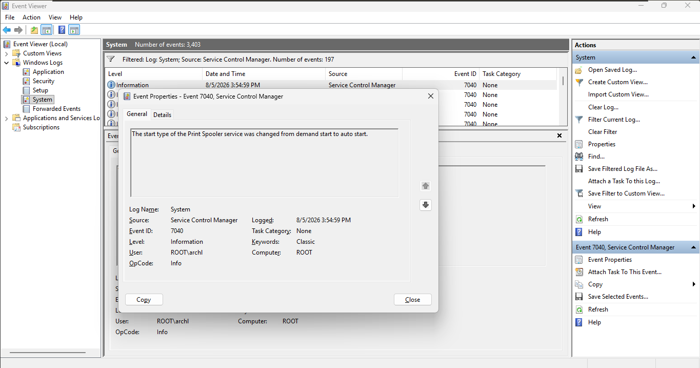

# Windows Service Management — Print Spooler Startup Recovery
## Objective
Diagnose and fix a Windows service misconfigured with the wrong startup type, using both the GUI (Services) and the command line (PowerShell), and verify the fix through Event Viewer.
---
## Environment
- VMware Workstation
- Windows 11 Pro
- Services (services.msc)
- PowerShell
- Event Viewer (eventvwr.msc)
---
## Steps
### GUI (Services)
1. Opened Print Spooler Properties and confirmed the broken state: Startup type manual, service status Stopped.
2. Changed Startup type to automatic, applied, and started the service.
3. Confirmed the fixed state: Startup type automatic, service status Running.
4. Verified the change was logged in Event viewer (System log, Service Control Manager source, event ID 7040).

### CLI (PowerShell)
1. Reverted the service to Manual/Stopped so the fix would demonstrate a real change.
2. Ran `Set-Service` and `Start-Service` to reapply the fix.
3. Ran `Get-Service` to confirm Status: Running.
4. Verified the change was logged in Event Viewer with a new Event ID 7040 entry, timestamped to match the PowerShell fix.

---
## Commands Used
```powershell
Get-Service -Name Spooler
```
```powershell
Set-Service -Name Spooler -StartupType Manual
Stop-Service -Name Spooler
```
```powershell
Set-Service -Name Spooler -StartupType Automatic
Start-Service -Name Spooler
Get-Service -Name Spooler
```

---
## Skills Practiced
- Windows service management (startup type, start/stop)
- PowerShell (Get-Service, Set-Service, Start-Service, Stop-Service)
- Event Viewer log filtering
- Root-cause verification instead of assuming a fix worked

## What I Learned
- Startup type (Manual/Automatic) and current status (Running/Stopped) are separate properties — changing one doesn't automatically change the other.
- Service Control Manager logs startup type changes under event ID 7040, with the message using "demand start" and "auto start" instead of the GUI's "Manual" and "Automatic" labels.
- Verifying through Event viewer confirms the change was actually applied and logged by the system, not just reflected in the GUI or terminal output at that moment.
- The same fix can be applied two different ways (GUI and CLI) and independently verified through the same log source.

## Screenshots
The following screenshots show the key stages of diagnosing and fixing the Print Spooler startup issue through both the GUI and PowerShell.

**GUI**








**PowerShell**



